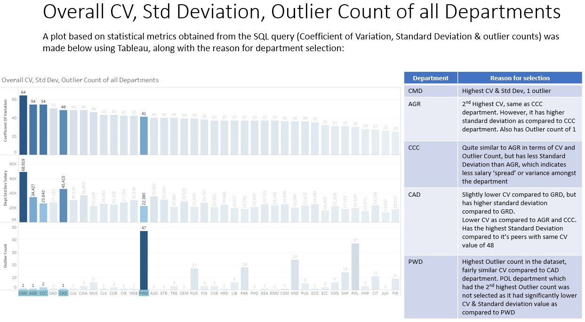

# Analysis of Departmental Salary Disparities [Tableau, Python, T-SQL, SQL Server Management Studio, Excel, Powerpoint]  
[GitHub Powerpoint link](Analysis_of_Departmental_Salary_Disparities_Project_Github.pdf)  |  [Google Drive PowerPoint Link](https://drive.google.com/file/d/1NHKyfNxlQOz1XQ-QVTc8FkYLNzQEfLgt/view?usp=sharing)  |  [Accompanying JupyterNoteBook](https://nbviewer.org/github/YongSookPrasitAttavit/Analysis-of-Departmental-Salary-Disparities-Project/blob/main/Analysis_of_Departmental_Salary_Disparities_AccompanyingJupyterNotebook.ipynb)  |  [GitHub Repository Link](https://github.com/YSPAttavit/Analysis-of-Departmental-Salary-Disparities-Project)

The dataset used in this analysis can be downloaded [here](data/Employee_Salaries.csv).

The link to the accompanying Tableau visualization used can be found below:

[Tableau Visualization Link](https://public.tableau.com/app/profile/ysook/viz/DepartmentalSalaryDisparitiesAnalysisProject_GitHub_SupportingTableauViz/Top5DepartmenttoinvestigateDashboard)

## Background
This project involves a statistical investigation into departmental salary disparities within a company. SQL & Python was used for statistical calculation, Tableau was used to create supporting visualizations.

Business Case:  
 - The data analytics manager of a company would like to seek insights into salary disparities present within the company department

Objective:  
 - Obtain relevant insights with Exploratory Data Analysis (EDA), and create a SQL query that identifies a high amount of variation within the department  
 - Provide the top 5 department that should be selected for management to review, with regards to having the most variance & discrepancy in salary

Deliverables:  
 - Provide a list from a SQL database with a way to score variation by Department  
 - JupyterNotebook with accompanying Python code block for SQL calculation cross-validation & EDA

Data from raw .csv file was ingested into SQL Server Management Studio [SSMS], from which SQL queries were iteratively built upon to obtain the final output which included departmental statistical information such as:
  - Standard Deviation
  - Average Salary
  - Coefficient Of Variation [CV]
  - Outlier Count based off Z-Score values

Through EDA with Python, I came to the conclusion that the dataset contained both hourly & annual salaried workers, through which the scope of the departmental salary analysis was eventually restricted to only include annual salaried workers as reflected in the final SQL code.

Additionally, through investigation of departmental salary distributions with histograms & relevant Quantile-Quantile plots in Python, I've concluded to place less emphasis on the count of outliers via Z-Score values & instead, place more emphasis on CV values & std. dev. during departmental evaluation.

An explanation on the significance of the 4 calculated values was mentioned in the accompanying Powerpoint Slide:

### Final SQL Code Blocks used for Tableau Visualization

Below is the final SQL Query used to output all 4 statistical metrics used in departmental salary disparity analysis

### Based on calculated statistical values, the top 5 departments flagged for management to review were selected:

